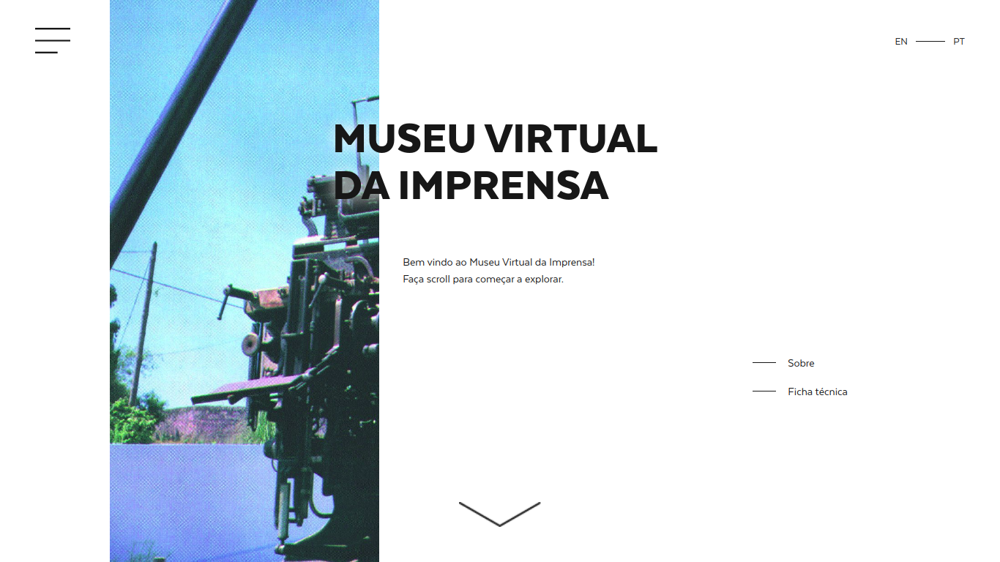
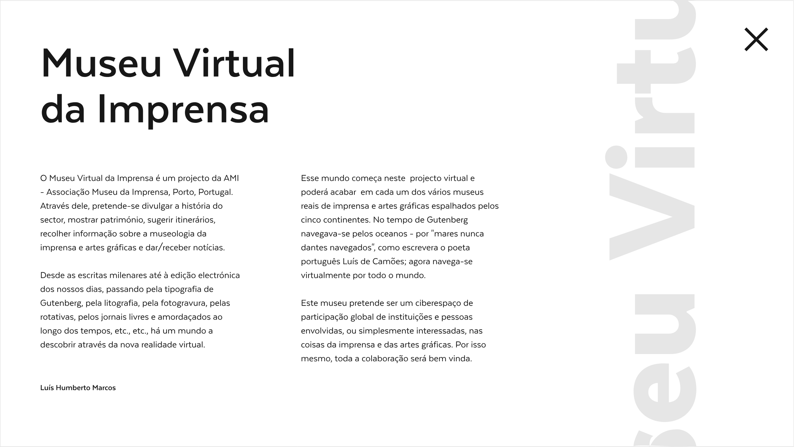
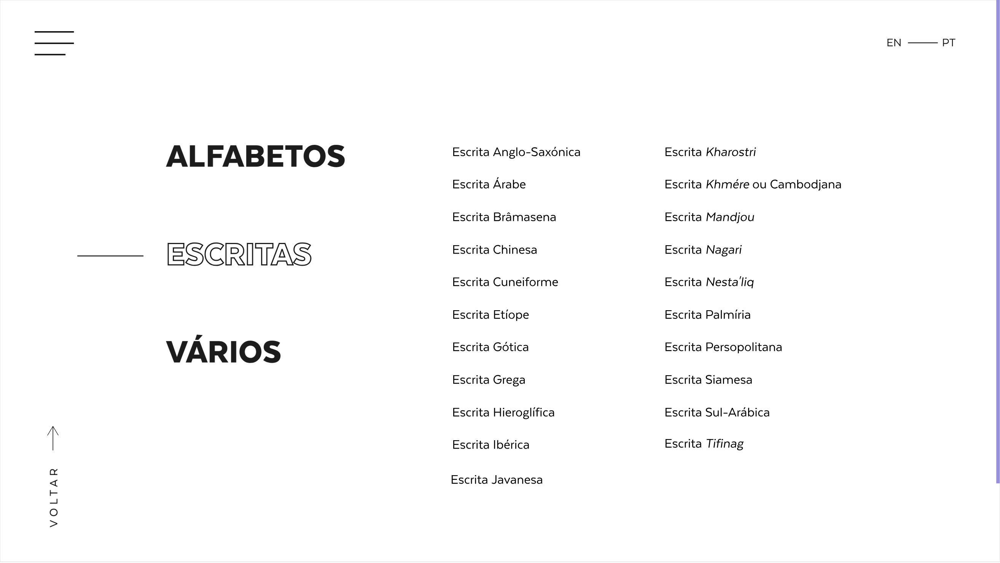
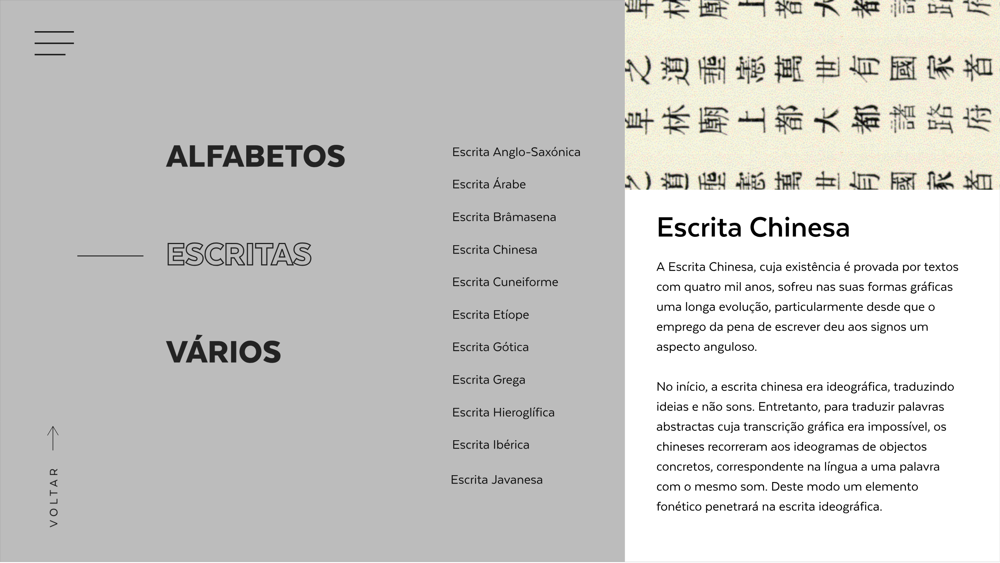
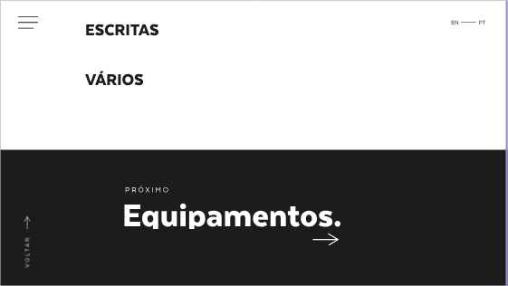
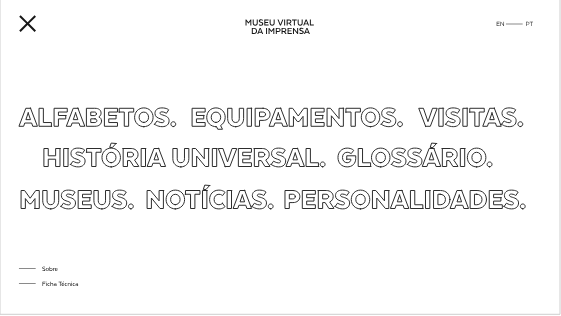
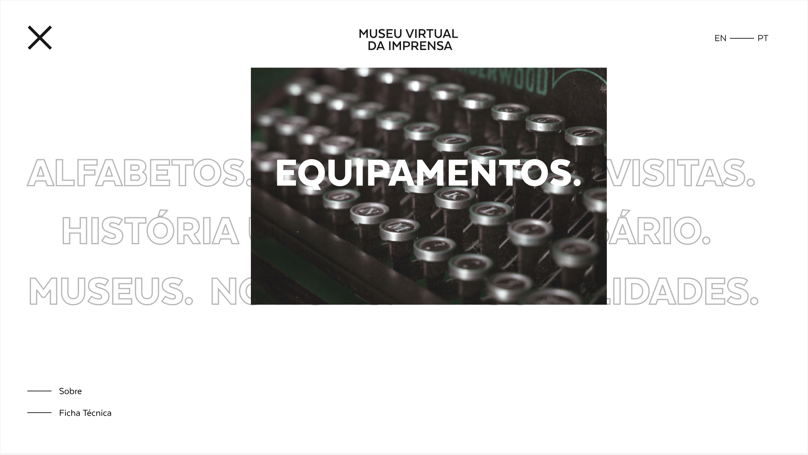
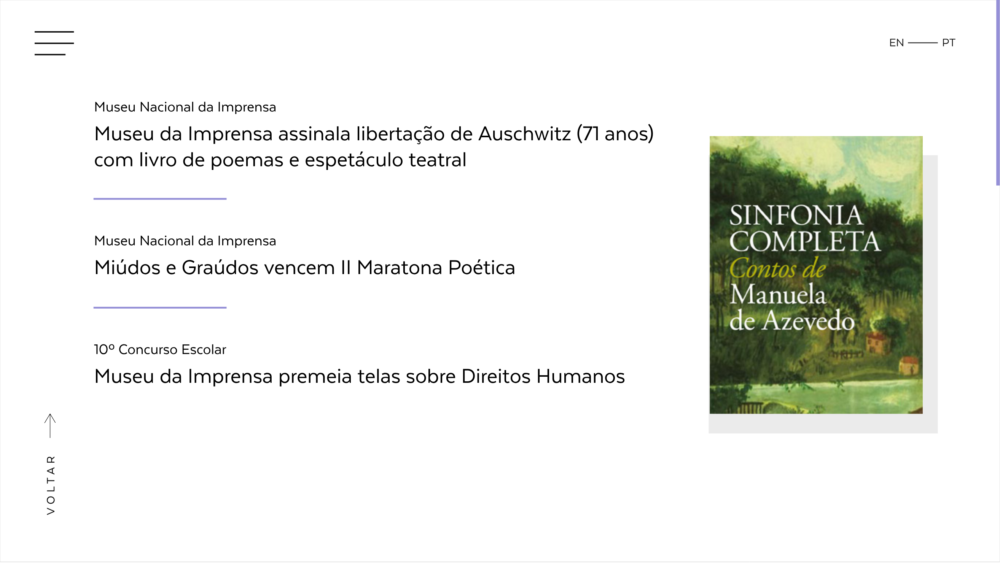
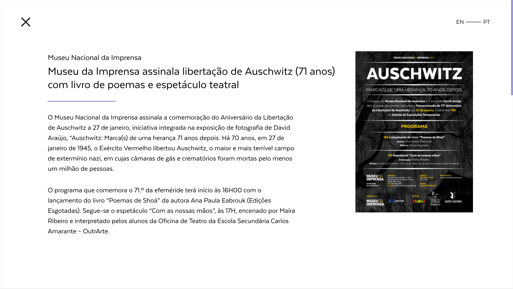

# mvi-website

The Virtual Press Museum (or VPM, for short) is a website dedicated to promote the physical instalations of Porto's National Press Museum.

## Gallery

### Landing

### About

### Alphabets

### Menu 

### News

